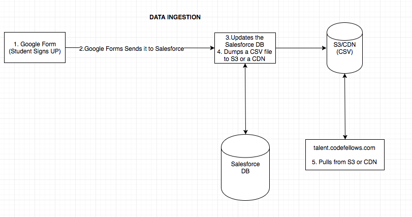

# **Frontend Hired.codefellows.org**

## Unbiased Resumes to Identify Qualified Candidates 

Product developed for clients: CodeFellows CEO Jeff Malek and VP of Education Brook Riggo.

Authors: Michael Porter, Saul Green, Ryan Felix and Nicu Parente

### Intro

Resume bias is a well documented occurrence. It refers to the prejudice for or against a candidates resume based on characteristics inferred from the document. These characteristics might include the candidates name, age, gender, interests, ethnicity, social status, appearance, or any other characteristic a hiring professional might derive an inference from unintentionally.

In an effort to meet the needs of a growing tech marketplace requiring new talent, perspective, ideas and diversity we have created a 'blind' unbiased resume source. Here randomized candidates can provide raw data to be evaluated upon without many of the naturally occurring biases present in a traditional resume.

### Current Version

The current version allows for parsing of CSV data on the backend, randomizing the profiles and presenting them in an unbiased manner with unbiased data. Users can add candidates to their client pool and connect with them. An email is then sent to both Codefellows and the User.

### Future Releases

  * Include filtering to filter resumes based on skills, learning interests and other characteristics.
  * Include authentication so users do not have to repeatedly enter contact info into the contact form.

### Wireframe Schema

### Dataflow Schema

### Google Form to Populate CSV

https://docs.google.com/forms/d/e/1FAIpQLSdBAGe0sQp5CvB2hajkPajyINaDB0GQ2ZnZrkP8V0lAOOW3kg/viewform

### Navigating at '/'

Loads with a description of why unbiased resumes are important.  The user can click the talent button in the navbar/header or the talent red button to see resumes of unbiased student data.

### Code at '/'

The landing container is nested in the App component which displays the header, footer and links to the landing container. The app component exists inside AppContainer which holds the provider.

### Navigating at '/talents'

The page loads with a get request to the back end server to receive the profiles. Profiles are populated on the page in a random order. Users can click the add button to add profiles to their client pool. When finished, users can click the connect button to connect with users.

### Code at '/talents'

The list-talents container is nested inside the App component. Nested inside the list-talents container is the talent-item. The talent-item is a mapped template based on the profiles received.

A profile-action triggered when setting the profiles adds the properties 'contacted' and 'selected' to manage added profiles to the client pool and previously contacted profiles which are stored in local storage. Once added to the client pool the selected property is changed from false to true and appears on the contact page.

There are several functions written to handle various states of true/false and empty string/string to populate the user profiles. These include several ternary statements to solve true false conditions. An object called imageAssign to map text to an image icon. imageOrText/mapImageOrText which displays the proper icon of image assign when present, but for something more difficult like 'Relational Database Management' it displays the text. Map maps the keys of an array when used to avoid react errors. showOrHideText/showOrHideImage show or hide the pre-content based on whether values are present. Attributes can be included.

### Navigating at '/connect'
To navigate to '/connect', the user must first go to the '/talent' page and select users then click the connect me button. Once you are in the '/connect' page you must fill in all the required values in the form or else the user will not be able to successfully connect. After hitting the connect button the user will be notified if it was successful or not. Finally the user will be able to check their email with the confirmation email.

### Code at '/connect'
The connect page utilizes list-talent component to rendered the selected profiles as well as the ReactModal component to render the terms of use. The form values are updated in the component state. After hitting send, a call to the backend route '/api/v1/connect' is made. The email, ids, name, terms and company are sent to as part of the body.

If we get a successful response from the backend, the ids are then stored on local storage in local storage so that on the when user goes to the talent page again, the contacted profiles will not show up.

If we get a failed respsonse the user will stay at the same page with the selected profile and is notified to try again.
