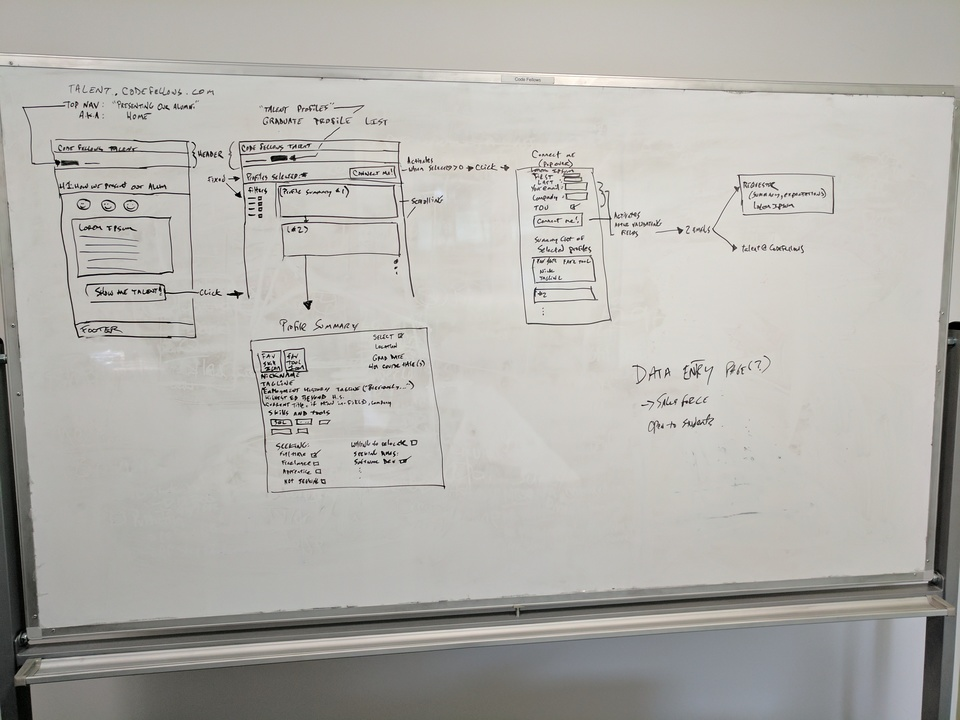

# **Frontend Hired.codefellows.org**

## Unbiased Resumes to Identify Qualified Candidates 

Product developed for clients: CodeFellows CEO Jeff Malek and VP of Education Brook Riggo.

Authors: Michael Porter, Saul Green, Ryan Felix and Nicu Parente

### Intro

Resume bias is a well documented occurrence. It refers to the prejudice for or against a candidates resume based on characteristics inferred from the document. These characteristics might include the candidates name, age, gender, interests, ethnicity, social status, appearance, or any other characteristic a hiring professional might derive an inference from unintentionally.

In an effort to meet the needs of a growing tech marketplace requiring new talent, perspective, ideas and diversity we have created a 'blind' unbiased resume source. Here randomized candidates can provide raw data to be evaluated upon without many of the naturally occurring biases present in a traditional resume.

### Current Version

The current version allows for parsing of CSV data on the backend, randomizing the profiles and presenting them in an unbiased manner with unbiased data. Users can add candidates to their client pool and connect with them. An email is then sent to both Codefellows and the User.

### Future Releases

  * Include filtering to filter resumes based on skills, learning interests and other characteristics.
  * Include authentication so users do not have to repeatedly enter contact info into the contact form.

### Wireframe Schema

### Dataflow Schema

### Google Form to Populate CSV

https://docs.google.com/forms/d/e/1FAIpQLSdBAGe0sQp5CvB2hajkPajyINaDB0GQ2ZnZrkP8V0lAOOW3kg/viewform

### Navigating at '/'

Loads with a description of why unbiased resumes are important.  The user can click the talent button in the navbar/header or the talent red button to see resumes of unbiased student data.

### Code at '/'

The landing container is nested in the App component which displays the header, footer and links to the landing container. The app component exists inside AppContainer which holds the provider.

### Navigating at '/talents'

The page loads with a get request to the backend to receive the profiles. Profiles are populated on the page in a random order. Users can click the add button to add profiles to their client pool. When finished, users can click the connect button to connect with users.

### Code at '/talents'

The list-talents container is nested inside the App component. Nested inside the list-talents container is the talent-item. The talent-item is a mapped template based on the profiles received.

A profile-action triggered when setting the profiles adds the properties 'contacted' and 'selected' to manage added profiles to the client pool and previously contacted profiles which are stored in local storage.

talent-item stuff

### Navigating at '/contacts'

### Code at '/contacts'
